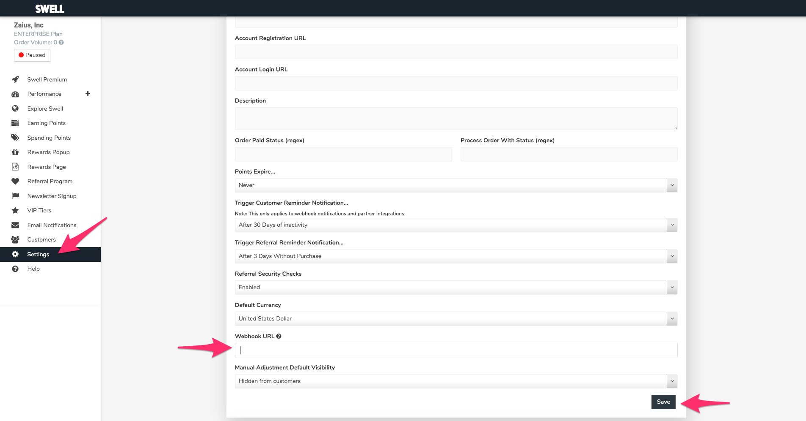

# Yotpo


The Zaius Yotpo app does not import ratings and reviews at this time.


The Yotpo Swell app receives loyalty, referral, and redemption data from Swell and maps it to your customers and creates new customers within Zaius as appropriate. While historical data is not imported, data is imported in real-time once connected.

## Setup

In Zaius:

1. Go to **Account Settings -&gt; Integrations**
2. Select **Yotpo** tile
3. Click **Install**
4. **Copy the Webhook URL** to clipboard

In Yotpo Swell:

1. Click **Settings**
2. **Paste the URL** from Zaius \(step 4 above\)
3. Click **Save**


Once you click "Save" updates to customers will happen as they occur, in real-time. 

Yotpo Swell does not support historical import at this time.


## Recipes


The Yotpo app extends the Loyalty & Rewards base schema.   
  
All the following functionality is additive unless otherwise noted.


### Filters

#### Standard Filters

| Name | Used by Yotpo |
| :--- | :--- |
| Loyalty Points Added | x |
| Loyalty Points Removed | x |
| Loyalty Tier Earned | x |
| Loyalty Tier Lost | x |
| Loyalty Referral Link Shared | x |
| Loyalty Referral Completed | x |

#### Custom Filters

| Name | Details |
| :--- | :--- |
|  |  |
|  |  |
|  |  |
|  |  |
|  |  |
|  |  |

### Behaviors

#### Standard Behaviors

| Name | Used by Yotpo |
| :--- | :--- |
| Loyalty Referral Link Shared, Not Completed \(7 days\) | x |
| Loyalty Tier Lost, Not Re-earned \(30 days\) | x |
| Loyalty Points Dropping & Not Raising \(5 times\) | x |

#### Custom Behaviors

| Name | Details |
| :--- | :--- |
|  |  |
|  |  |
|  |  |
|  |  |
|  |  |
|  |  |

### Segments

#### Standard Segments

| Name | Used by Yotpo |
| :--- | :--- |
| Enrolled Loyalty Members | x |

#### Custom Segments

| Name | Details |
| :--- | :--- |
|  |  |
|  |  |
|  |  |
|  |  |
|  |  |
|  |  |

### Campaigns

#### Standard Campaigns

| Name | Used by Yotpo |
| :--- | :--- |
| Loyalty Points Earned | x |
| Loyalty Points Removed | x |
| Lost Loyalty Tier | x |
| Earned Loyalty Tier | x |
| Referral Completed | x |
| Loyalty Member Enrollment Welcome | x |

#### Custom Campaigns

| Name | Details |
| :--- | :--- |
|  |  |
|  |  |
|  |  |
|  |  |
|  |  |
|  |  |

## Objects & Fields

### Objects

| Object Name | Description |
| :--- | :--- |
| Yotpo Perks \(`yotpo_perks`\) |  |
| Yotpo Redemptions \(`yotpo_redemptions`\) |  |
| Yotpo Redemption Options \(`yotpo_redemption_options`\) |  |

### Fields

#### Events \(events\)

| Field Name | Type | Description |
| :--- | :--- | :--- |
| `yotpo_redemption_id` | string |  |
| `yotpo_redemption_option_id` | string |  |
| `yotpo_points_needed` | number |  |
| `yotpo_perk_id` | string |  |
| `yotpo_referred_customer_first_name` | string |  |
| `yotpo_referred_customer_last_name` | string |  |

#### Customers \(customers\)

To learn more about Customers in Zaius, refer to the following:

| Field Name | Type | Description |
| :--- | :--- | :--- |
| `yotpo_points_earned` | number |  |
| `yotpo_points_expire_at` | ts |  |
| `yotpo_last_seen_at` | ts |  |
| `yotpo_third_party_id` | string |  |
| `yotpo_pos_account_id` | string |  |
| `yotpo_has_store_account` | boolean |  |
| `yotpo_subscribed` | boolean |  |
| `yotpo_is_member` | boolean |  |
| `yotpo_source` | string |  |
| `yotpo_expiration_job_id` | string |  |
| `yotpo_perks_redeemed` | number |  |

#### Loyalty Tiers \(loyalty\_tiers\)

| Field Name | Type | Description |
| :--- | :--- | :--- |
| `yotpo_loyalty_tier_points_multiplier` | number |  |

#### Loyalty Referral Codes \(loyalty\_referral\_codes\)

| Field Name | Type | Description |
| :--- | :--- | :--- |
| `yotpo_emails_sent` | number |  |
| `yotpo_emails_viewed` | number |  |
| `yotpo_facebook_shares` | number |  |
| `yotpo_email_shares` | number |  |
| `yotpo_twitter_shares` | number |  |
| `yotpo_links_clicked_from_facebook` | number |  |
| `yotpo_links_clicked_from_email` | number |  |
| `yotpo_links_clicked_from_twitter` | number |  |
| `yotpo_average_amount_cents` | number |  |
| `yotpo_expires_at` | ts |  |
| `yotpo_unique_clicks` | number |  |

#### Yotpo Perks \(yotpo\_perks\)

| Field Name | Type | Description |
| :--- | :--- | :--- |
| \`\` |  |  |
|  |  |  |
|  |  |  |

#### Yotpo Redemptions \(yotpo\_redemptions\)

| Field Name | Type | Description |
| :--- | :--- | :--- |
| \`\` |  |  |
|  |  |  |
|  |  |  |

#### Yotpo Redemption Options \(yotpo\_redemption\_options\)

| Field Name | Type | Description |
| :--- | :--- | :--- |
| \`\` |  |  |
|  |  |  |
|  |  |  |

### Relationships

| Name | Parent | Child |
| :--- | :--- | :--- |
|  |  |  |
|  |  |  |
|  |  |  |
|  |  |  |
|  |  |  |

## Events

### Standard Events

#### Event Type: `loyalty`

| Event Action | Used by Yotpo |
| :--- | :--- |
| `points_added` | x |
| `points_removed` | x |
| `referral_completed` | x |
| `referral_link_shared` | x |
| `tier_earned` | x |
| `tier_lost` | x |
| `enrolled` | x |

### Custom Events

#### Event Type: `yotpo`

| Event Action | Fields |
| :--- | :--- |
| `redemption` | \`\` |

