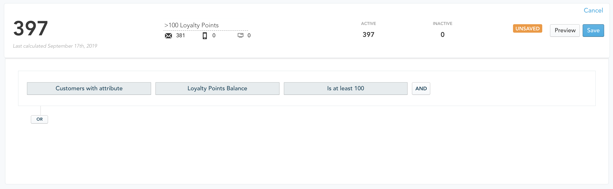

# Yotpo Swell


Yotpo Swell is currently in **BETA**  
  
Wide release is planned for **late October 2019**.


## Why install Yotpo for Zaius?

* Augment customer records with attributes like **Loyalty Points Balance** and **Loyalty Tier**
* **Create personalized content** that uses the customer's current Loyalty Points Balance or Loyalty Tier
* Remind your customers to **share their referral link** to earn points 
* Notify customers that their **shared referral link has not been claimed**
* Notify customers that they have **achieved a new Loyalty Tier** and drive them to your website to claim  rewards or that they **have lost a Loyalty Tier** and provide actions to earn the tier back
* Reward customers with **Birthday offers**
* Remind customers that they have **unused Loyalty Points that are expiring soon**

...and much, much more!

## Requirements / Limitations

* **An active paid subscription to Yotpo Loyalty** \(also known as _Swell_ or _Yotpo Swell_\).
* The Zaius Yotpo app **does not import Ratings and Reviews** at this time.
* The Zaius Yotpo app **does not import historical data from Yotpo**, data is collected on a go-forward basis.
* The beta **does not support Loyalty Tier, Coupon or Offers in event-triggered campaigns.**

## Screenshots

### Example Campaign

## Setup & Installation

In Zaius:

1. Go to **Account Settings -&gt; Integrations**
2. Select **Yotpo** tile
3. Click **Install**
4. **Copy the Webhook URL** to clipboard

In Yotpo Swell:

1. Click **Settings**
2. **Paste the URL** from Zaius \(step 4 above\)
3. Click **Save**


Once you click "Save" updates to customers will happen as they occur, in real-time. 

Yotpo Swell does not support historical import at this time.


## Available Recipes


Gain access to the following recipes by contacting Zaius support.


| Recipe Name |
| :--- |
| Yotpo: Loyalty Referral Completed |
| Yotpo: Loyalty Points Expire Soon |
| Yotpo: Loyalty Coupon Reminder |
| Yotpo: Loyalty Coupon Earned |
| Yotpo: Loyalty Tier Earned |
| Yotpo: Loyalty Tier Lost |
| Yotpo: Loyalty Points Available Reminder |
| Yotpo: Loyalty Referral Not Claimed |
| Yotpo: Loyalty Birthday Coupon |

## Data Overview

### Events

#### Standard Events

| Event Type | Event Action | Used by Yotpo |
| :--- | :--- | :--- |
| `loyalty` | `points_added` | x |
| `loyalty` | `points_removed` | x |
| `loyalty` | `referral_completed` | x |
| `loyalty` | `referral_link_shared` | x |
| `loyalty` | `tier_earned` | x |
| `loyalty` | `tier_lost` | x |

#### App Events 

<table>
  <thead>
    <tr>
      <th style="text-align:left">Event Type</th>
      <th style="text-align:left">Event Action</th>
      <th style="text-align:left">Fields</th>
    </tr>
  </thead>
  <tbody>
    <tr>
      <td style="text-align:left"><code>loyalty</code>
      </td>
      <td style="text-align:left"><code>yotpo_coupon_awarded</code>
      </td>
      <td style="text-align:left">
        
<code>yotpo_redemption_id</code>
        

        
<code>yotpo_redemption_option_id</code>
        

        
<code>yotpo_perk_id</code>
        

      </td>
    </tr>
    <tr>
      <td style="text-align:left"><code>loyalty</code>
      </td>
      <td style="text-align:left"><code>yotpo_points_redeemed</code>
      </td>
      <td style="text-align:left">
        
<code>yotpo_redemption_id</code>
        

        
<code>yotpo_redemption_option_id</code>
        

        
<del><code>yotpo_perk_id</code></del>
        

      </td>
    </tr>
    <tr>
      <td style="text-align:left"><code>loyalty</code>
      </td>
      <td style="text-align:left"><code>yotpo_redemption_reminder</code>
      </td>
      <td style="text-align:left">
        
<code>yotpo_redemption_option_id</code>
        

        
<code>yotpo_points_needed</code>
        

      </td>
    </tr>
    <tr>
      <td style="text-align:left"><code>loyalty</code>
      </td>
      <td style="text-align:left"><code>yotpo_birthday_reminder</code>
      </td>
      <td style="text-align:left">
        
<code>current_loyalty_points_balance</code>
        

        
<code>yotpo_redemption_id</code>
        

        
<code>yotpo_redemption_option_id</code>
        

      </td>
    </tr>
  </tbody>
</table>### Objects & Fields

The Yotpo Swell app imports all data in the Loyalty & Rewards base schema **IN ADDITION TO** the objects and fields below.

#### Objects

| Object Name |
| :--- |
| Yotpo Perks \(`yotpo_perks`\) |
| Yotpo Redemptions \(`yotpo_redemptions`\) |
| Yotpo Redemption Options \(`yotpo_redemption_options`\) |

#### Fields

#### Events \(events\)

| Field Name | Type | Description |
| :--- | :--- | :--- |
| `yotpo_redemption_id` | string | ID of the associated redemption \(coupon\) in Yotpo |
| `yotpo_redemption_option_id` | string | ID of the associated redemption option \(coupon type\) in Yotpo |
| `yotpo_points_needed` | number | Points a customer needs to earn for a coupon in a coupon reminder event |
| `yotpo_perk_id` | string | The ID of the Yotpo Perk \(reward\) relevant to this event |
| `yotpo_referred_customer_first_name` | string | First name of the referred customer |
| `yotpo_referred_customer_last_name` | string | Last name of the referred customer |

#### Customers \(customers\)

To learn more about Customers in Zaius, refer to the following:

| Field Name | Type | Description |
| :--- | :--- | :--- |
| `yotpo_points_earned` | number | Number of loyalty points earned via Yotpo |
| `yotpo_points_expire_at` | ts | Expiration date, if applicable, for when Yotpo points expire |
| `yotpo_last_seen_at` | ts | Date/time customer was last seen by Yotpo |
| `yotpo_third_party_id` | string | Third party ID, if any, for this customer provided to your eCommerce Yotpo integration |
| `yotpo_pos_account_id` | string | POS account ID, if any, for this customer provided to your eCommerce Yotpo integration |
| `yotpo_has_store_account` | boolean | True if this customer is associated with a store account through Yotpo |
| `yotpo_source` | string | Where the customer came from, if referred |
| `yotpo_expiration_job_id` | string | Expiration job ID within Yotpo |
| `yotpo_perks_redeemed` | number | Number of perks redeemed through Yotpo |

#### Loyalty Tiers \(loyalty\_tiers\)

| Field Name | Type | Description |
| :--- | :--- | :--- |
| `yotpo_loyalty_tier_points_multiplier` | number | Points multiplier for this tier in Yotpo |

#### Loyalty Referral Codes \(loyalty\_referral\_codes\)

| Field Name | Type | Description |
| :--- | :--- | :--- |
| `yotpo_emails_sent` | number | Number of emails sent by Yotpo |
| `yotpo_emails_viewed` | number | Number of views for emails sent by Yotpo |
| `yotpo_facebook_shares` | number | Number of Facebook shares through Yotpo |
| `yotpo_email_shares` | number | Number of email shares through Yotpo |
| `yotpo_twitter_shares` | number | Number of Twitter shares through Yotpo |
| `yotpo_links_clicked_from_facebook` | number | Number of clicks for Facebook shares through Yotpo |
| `yotpo_links_clicked_from_email` | number | Number of clicks for email shares through Yotpo |
| `yotpo_links_clicked_from_twitter` | number | Number of clicks for Twitter shares through Yotpo |
| `yotpo_average_amount` | number | Average referral order value as reported from Yotpo |
| `yotpo_unique_clicks` | number | Number of unique clicks for messages sent through Yotpo |

#### Yotpo Perks \(yotpo\_perks\)

| Field Name | Type | Description |
| :--- | :--- | :--- |
| `perk_id` | string | Yotpo Perk ID |
| `campaign_id` | number | Associated campaign ID within Yotpo |
| `merchant_id` |  number | Associated merchant ID within Yotpo |
| `customer_id` | number | Associated customer ID within Yotpo |
| `reward_points` | number | Reward points associated with the perk |
| `completed` | boolean | True if the requirements for the perk were met |
| `completed_at` | timestamp | When the perk was rewarded |
| `awarded` | boolean | True if the per was awarded / redeemed |
| `awarded_at` | timestamp | When the perk was awarded |
| `pending` | boolean | True if the award is pending |
| `reversed` | boolean | True if the perk was reversed in Yotpo |
| `reversed_at` | timestamp | When the perk was reversed |
| `expired_at` | timestamp | When the perk expired |
| `expires_at` | timestamp | When the perk expires |
| `redemption_option_id` | number | The ID of the associated redemption option |
| `history_title` | string | History description provided by Yotpo |
| `created_at` | timestamp | When the perk was created |

#### Yotpo Redemptions \(yotpo\_redemptions\)

| Field Name | Type | Description |
| :--- | :--- | :--- |
| `redemption_id` | string | ID of the redemption in Yotpo |
| `created_at` | timestamp | When the redemption was created |
| `updated_at` | timestamp | When the redemptionw as last updated |
| `reward_text` | string | Description of the reward, formatted for display to a customer |
| `approved` | boolean | True if the redemption was approved |
| `approved_at` | timestamp | Time when the redemption was approved |
| `is_admin` | boolean | True if created by an admin |
| `is_pos` | boolean | True if created at POS |
| `at_checkout` | boolean | True if created at checkout |
| `third_party_id` | string | Thrid party id associated with the redemption, e.g. coupon code |

#### Yotpo Redemption Options \(yotpo\_redemption\_options\)

| Field Name | Type | Description |
| :--- | :--- | :--- |
| `redemption_option_id` | string | ID of the redemption option in Yotpo |
| `name` | string | Name of the redemption option in Yotpo |
| `description` | string | Description of the redemption option in Yotpo |
| `icon` | string | Icon used by the Yotpo integrations to represent this option |
| `cost_text` | string | Cost to redeem, formatted for display to a customer |
| `amount` | number | Number of points required to redeem for this reward |

#### Relationships

| Name | Parent | Child |
| :--- | :--- | :--- |
| `yotpo_redemption_option` | `events` | `yotpo_redemption_options` |
| `yotpo_redemption` | `events` | `yotpo_redemptions` |
| `yotpo_perk` | `events` | `yotpo_perks` |
| `yotpo_redemption_option` | `yotpo_perks` | `yotpo_redemption_options` |

